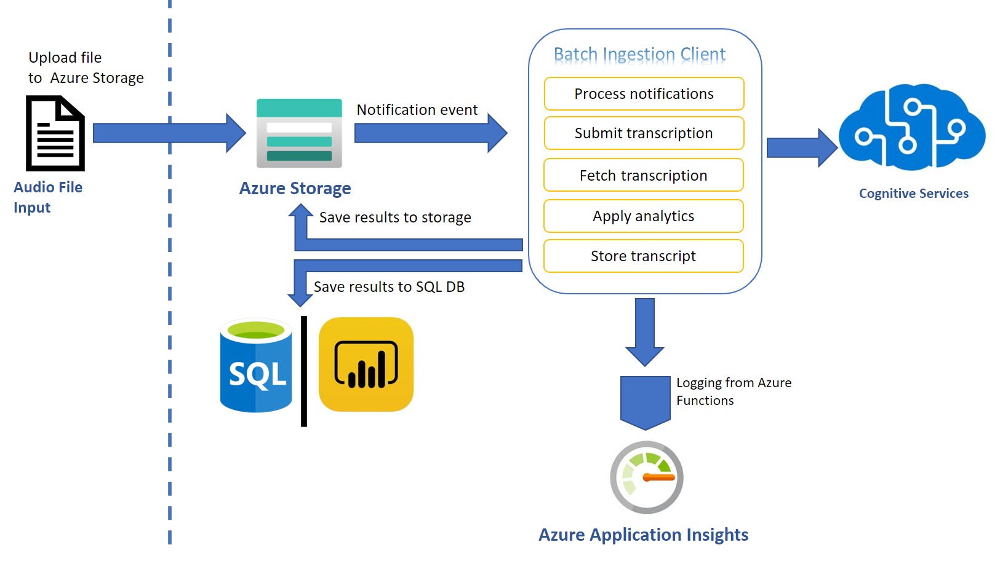
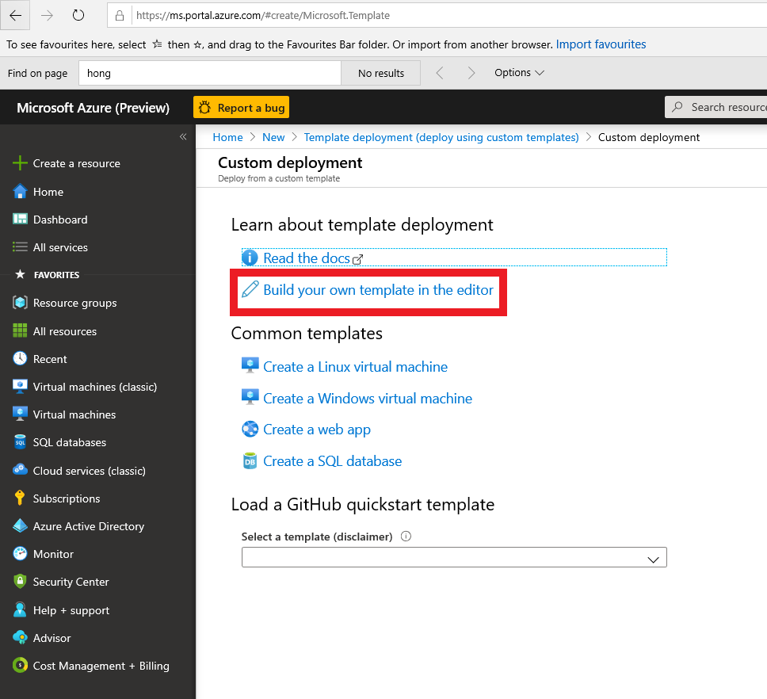

# Getting started with the Batch Ingestion Client

Get your audio files automatically transcribed without writing any code what-so-ever! The Batch Ingestion Client will monitor your dedicated Azure Storage container so that new audio files are transcribed automatically as soon as they land.

The simplest way to explain this tech is as an automated & scalable transcription solution for all your audio files in your Azure Storage. If you are looking for a quick and effortless way to transcribe your audio files or even explore transcription, then this solution is for you. 

We created an ingestion layer (a client for batch transcription) that will help you set-up a full blown, scalable and secure transcription pipeline and through an ARM template deployment, all the resources necessary to seamlessly process your audio files are set-up and set in motion.

# Architecture

This is a smart client in the sense that it implements best practices and optimized against the capabilities of the Azure Speech infrastructure. It utilizes Azure resources such as Service Bus and Azure Functions to orchestrate transcription requests to Azure Speech Services from audio files landing in your dedicated storage containers. Do you need more than transcription? Do you need to applly Sentiment to your transcript? Downstream analytics are possible too, with Text Analytics Sentiment and Redaction being offered as part of this solution too. 

Before we delve deeper into the set-up instructions, let us have a look at the architecture of the solution this ARM template builds. 



The diagram is simple and hopefully self-explanatory. As soon as files land in a storage container, the Grid Event that indicates the complete upload of a file is filtered and pushed to a Service bus topic. Azure Functions (time triggered by default) pick up those events and act, namely creating Tx requests using the Azure Speech Services batch pipeline. When the Tx request is successfully carried out an event is placed in another queue in the same service bus resource. A different Azure Function triggered by the completion event starts monitoring transcription completion status and copies the actual transcripts in the containers from which the audio file was obtained. This is it. The rest of the features are applied on demand. Users can choose to apply analytics on the transcript, produce reports or redact, all of which are the result of additional resources being deployed through the ARM template. The solution will start transcribing audio files without the need to write any code. If -however- you want to customize further this is possible too. The code is available in this repo.

The list of best practices we implemented as part of the solution are:

1. Optimized the number of audio files included in each transcription with the view of achieving the shortest possible SAS TTL.
2. Round Robin around selected regions in order to distribute load across available regions (per customer request)
3. Retry logic optimization to handle smooth scaling up and transient HTTP 429 errors
4. Running Azure Functions economically, ensuring minimal execution costs

## Setup Guide

The following guide will help you set up and execute the ARM templates.

## Prerequisites

An [Azure Account](https://azure.microsoft.com/free/) as well as an [Azure Speech Services key](https://ms.portal.azure.com/#create/Microsoft.CognitiveServicesSpeechServices) is needed to run the Batch Ingestion Client.

> **_NOTE:_** You need to create a Speech Resource with a paid (S0) key. The free key account will not work. Optionally for analytics you can create a Text Analytics resource too.

If the above link does not work try the following steps:

1. Go to [Azure portal](https://portal.azure.com)
2. Click on +Create Resource
3. Type Speech and
4. Click Create on the Speech resource.
5. You will find the subscription key under **Keys**
6. You will also need the region, so make a note of that too.
7. You need to decide on the operating mode [read next section] 

To test your the set up we reccomend you use [Microsoft Azure Storage Explorer](https://azure.microsoft.com/features/storage-explorer/).

### Operating Mode

Audio files can be processed either by the v3 API (batch) or our Speech SDK (real time). Both operations are wrapped and implemented in serverless and although seamless to the user there are sublte differences. The goal of this section is to explain the pros and cons of these options.

#### Batch Mode

In this mode you will experience the following

1. Low Azure Function costs [2 Azure Functions will coordinate the process and run for milliseconds]
2. Diarization and Sentiment [offered in Batch Mode only]
3. Higher Latency. Transcripts are scheduled and executed based on capacity of cluster [real time mode takes priority]
4. You will need to deploy the [Batch ARM Template](ArmTemplateBatch.json) from the repository for this operating mode.

#### Real Time Mode

In this mode you will experience the following

1. Higher Azure Function costs [A single type Azure Functions will handle the process for each file and run at least for half the audio length]
2. 2x processing of audio files [i.e. a 10-min file is transcribed in 5mins]
3. There is no availability of Diarization or Sentiment in real time
4. You will need to use the [Real Time ARM Template](ArmTemplateRealTime.json) from the repository for this operating mode.

## Ingestion Client Setup Instructions

Irrespective of the operating mode the ARM templates are largely the same. The main differences are the lack of diarization and sentiment options in Real Time mode. With that in mind please follow the instructions below to deploy the resources from ARM template.

1. Click on **+Create Resource** on [Azure portal](https://portal.azure.com) as shown in the following picture and type ‘ _template
deployment_ ’ on the search box.


2. Click on **Create** Button on the screen that appears as shown below.


3. You will be creating the relevant Azure resources from the ARM template provided. Click on click on the ‘Build your own template in the editor’ link and wait for the new screen to load.



Hou will be loading the template via the **Load file** option. Alternatively,
you could simply copy/paste the template in the editor.


4. Once the template text is loaded you will be able to read and edit the transcript. Do
**NOT** attempt any edits at this stage. You need to save the template you loaded so please cick the **Save** button


Saving the template will result in the screen below. You will need to fill in the form provided. It is
important that all the information is correct. Let us look at the form and go through each field.


> **_NOTE:_** Please use short descriptive names in the form for your resource group. Long resource group names may result in deployment error


* First pick the Azure Subscription Id within which you will create the resources.

* Either pick or create a resource group. [It would be better to have all the Batch Ingestion Client
resources within the same resource group so we suggest you create a new resource group].

* Pick a region [May be the same region as your Azure Speech key].

The following settings all relate to the resources and their attributes

* Give your storage account a name [you will be using a new storage
account rather than an existing one].

The following 2 steps are optional. Omitting them will result in using the base model to obtain
transcripts. If you have created a Speech model, then

* Enter optionally a custom model

Transcripts are obtained by polling the service. We acknowledge that there is a cost related to that.
So, the following setting gives you the option to limit that cost by telling your Azure Function how
often you want it to fire.


* Enter the polling frequency [There are many scenarios where this would be required to be
done couple of times a day]

* Enter locale of the audio [you need to tell us what language model we need to use to
transcribe your audio.]

* Enter your Azure Speech subscription key and Locale information

> **_NOTE:_** If you plan to transcribe large volume of audio (say millions of files) we propose that you rotate the traffic between regions. In the Azure Speech Subscription Key text box you can put as many keys separated by column ';'. 
> In is important that the corresponding regions (Again separated by column ';') appear in the Locale information text box.
> For example if you have 3 keys (abc, xyz, 123) for east us, west us and central us respectively then lay them out as follows 'abc;xyz;123' followed by 'east us;west us;central us'

The rest of the settings related to the transcription request. You can read more about those in our
[docs](https://docs.microsoft.com/azure/cognitive-services/speech-service/batch-transcription).


* Select a profanity option

* Select a punctuation option

* Select to Add Diarization [all locales] [Batch Only]

* Select to Add Word level Timestamps [all locales] [Batch Only]


If you want to perform Text Analytics please add those credentials.


* Add Text analytics key

* Add Text analytics region

* Add Sentiment [Batch Only]

* Add data redaction [Batch Only]


If you want to further analytics we could map the transcript json we produce to a DB schema. 

* Enter SQL DB credential login

* Enter SQL DB credential password


You can feed that data to your custom PowerBI script or take the scripts included in this repository. Follow the [PowerBI guide](../Power BI/guide.md) for setting it up.

Press **Create** to trigger the resource creating process. It typically takes 1-2 mins. The set of resources
are listed below.


If a Consumption Plan (Y1) was selected for the Azure Functions, make sure that the functions are synced with the other resources (see [this](https://docs.microsoft.com/azure/azure-functions/functions-deployment-technologies#trigger-syncing) for further details).

To do so, click on your StartTranscription function in the portal and wait until your function shows up:


Do the same for the FetchTranscription function:


> **_Important:_** Until you restart both Azure functions you may see errors.

## Running the Ingestion Client

Upload audio files to the newly created audio-input container (results are added to json-result-output and test-results-output containers).
Once they are done you can test your account.

Use [Microsoft Azure Storage Explorer](https://azure.microsoft.com/features/storage-explorer/) to test uploading files to your new account. The process of transcription is asynchronous. Transcription usually takes half the time of the audio track to be
obtained.

The structure of your newly created storage account will look like the picture below.


There are several containers to distinguish between the various outputs. We suggest (for the sake of keeping things tidy) to follow the pattern and use the audio-input container as the only container for uploading your audio.

## Customizing the Ingestion Client

By default, the ARM template uses the newest version of the Batch Ingestion Client which can be found in this repository. If a custom version should be used, the paths to the binaries inside the deployment template must be edited to point to a custom published version (by default, our binaries are: 

* https://mspublicstorage.blob.core.windows.net/transcription-enabled-storage/FetchTranscription.zip, 

* https://mspublicstorage.blob.core.windows.net/transcription-enabled-storage/StartTranscriptionByTimer.zip and 

* https://mspublicstorage.blob.core.windows.net/transcription-enabled-storage/StartTranscriptionByServiceBus.zip). 

To publish a new version, you can use Visual Studio, right click on the respective project, click publish and follow the instructions.

## The Project

Although you do not need to download or do any changes to the code you can still download it from GitHub:

```
git clone https://github.com/Azure-Samples/cognitive-services-speech-sdk
cd cognitive-services-speech-sdk/samples/batch/transcription-enabled-storage
```

## Costs 

The created resources their pricing and correspoding plans (where applicable) are:

* [Storage Pricing](https://azure.microsoft.com/en-gb/pricing/details/storage/), Simple Storage

* [Service Bus Pricing](https://azure.microsoft.com/en-us/pricing/details/service-bus/), Standard 

* [Azure Functions Pricing](https://azure.microsoft.com/en-us/pricing/details/functions/), Premium

* [Key Vault Pricing](https://azure.microsoft.com/en-us/pricing/details/key-vault/)

Optionally

* [Sql DB Pricing](https://azure.microsoft.com/en-us/pricing/details/sql-database/single/)
* [PowerBI](https://powerbi.microsoft.com/en-us/)

The following example is indicative of the cost distributions to inform and set the cost expectations.

Assume a scenario where we are trying to transcribe 1000 mp3 files of an average length of 10mins and size of 10MB. Each of them individually landing on the storage container over the course of a business day.

[Speech Transcription](https://azure.microsoft.com/en-us/services/cognitive-services/speech-to-text/) Costs are: 10k mins = **$166.60**

[Service Bus](https://azure.microsoft.com/en-us/services/service-bus) Costs are: 1k events landing in 'CreateTranscriptionQueue' and another 1k in 'FetchTranscriptionQueue' = **$0.324/daily** (standing charge) for up to 13m messages/month 

[Storage](https://azure.microsoft.com/en-gb/services/storage/) Costs are: Write operations are $0.0175 (per 10,000), and Read operations $0.0014 (again per 10k read operations) = ($0.0175 + $0.0014)/10 (for 1000 files) = **$0.00189**

[Azure Functions](https://azure.microsoft.com/en-us/services/functions/) Costs are: The first 400,000 GB/s of execution and 1,000,000 executions are free = $0.00

[Key Vault](https://azure.microsoft.com/en-us/services/key-vault/) Costs are: 0.03/10,000 transactions (For the above scenario 1 transations would be required per file) = **$0.003**

The total for the above scenario would be **$166.60**, with the majority of the cost being on transcription. The message here is that all this additional convinience comes at a franction of an addition to your original transcription costs.

We trust that the above scenario gives you an idea of the costs distributions. Of course will vary depending on scenario and usage pattern.

Please use our [Azure Calculator](https://azure.microsoft.com/pricing/calculator/) to better understand pricing
