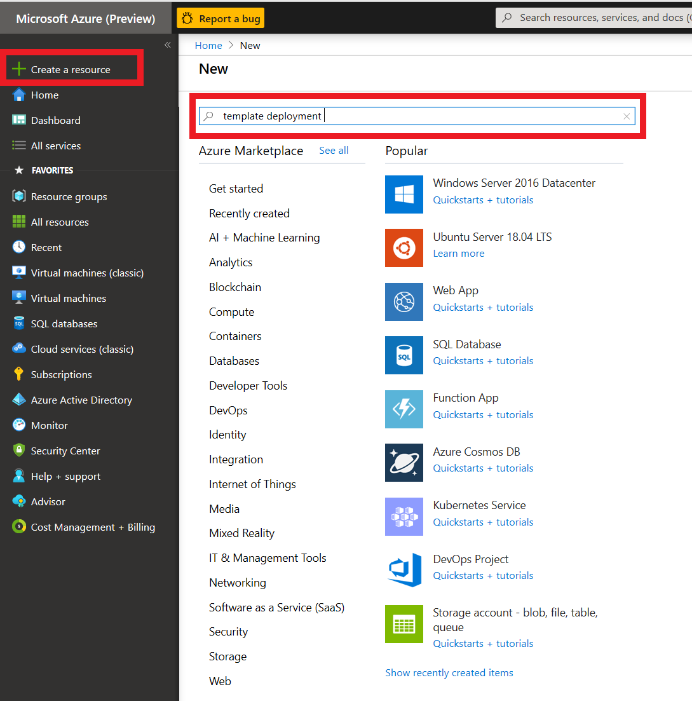

# Getting started with the Accelerator

## Setup Guide

The following guide will help you create a set of resources on Azure that will manage the
transcription of audio files.

## Prerequisites

An [Azure Account](https://azure.microsoft.com/en-us/free/) as well as an [Azure Speech Services key](https://ms.portal.azure.com/#create/Microsoft.CognitiveServicesSpeechServices) is needed to run the Accelerator.

> [!IMPORTANT]
> You need to create a Speech Resource with a paid (S0) key. The free key account will not work. Optionally for analytics you can create a Text Analytics resource too.

If the above link does not work try the following steps:

1. Go to [Azure portal](https://portal.azure.com)
2. Click on +Create Resource
3. Type Speech and
4. Click Create on the Speech resource.
5. You will find the subscription key under **Keys**
6. You will also need the region, so make a note of that too.

To test your account we suggest you use [Microsoft Azure Storage Explorer](https://azure.microsoft.com/en-us/features/storage-explorer/).

### The Project

Although you do not need to download or do any changes to the code you can still download it from GitHub:

```
git clone https://github.com/Azure-Samples/cognitive-services-speech-sdk
cd cognitive-services-speech-sdk/samples/batch/transcription-enabled-storage
```

Make sure that you have downloaded the [ARM Template](ArmTemplate.json) from the repository.

## Accelerator Setup Instructions

1. Click on **+Create Resource** on [Azure portal](https://portal.azure.com) as shown in the following picture and type ‘ _template
deployment_ ’ on the search box.



2. Click on **Create** Button on the screen that appears as shown below.


3. You will be creating the relevant Azure resources from the ARM template provided. Click on click on the ‘Build your own template in the editor’ link and wait for the new screen to load.


Hou will be loading the template via the **Load file** option. Alternatively,
you could simply copy/paste the template in the editor.


4. Once the template text is loaded you will be able to read and edit the transcript. Do
**NOT** attempt any edits at this stage. You need to save the template you loaded so please cick the **Save** button


Saving the template will result in the screen below. You will need to fill in the form provided. It is
important that all the information is correct. Let us look at the form and go through each field.


> [!NOTE]
> Please use short descriptive names in the form for your resource group. Long resource group names may result in deployment error


* First pick the Azure Subscription Id within which you will create the resources.

* Either pick or create a resource group. [It would be better to have all the accelerator
resources within the same resource group so we suggest you create a new resource group].

* Pick a region [May be the same region as your Azure Speech key].

The following settings all relate to the resources and their attributes


* Give your transcription enabled storage account a name [you will be using a new storage
account rather than an existing one].

The following 2 steps are optional. Omitting them will result in using the base model to obtain
transcripts. If you have created a Speech model, then


* Enter optionally your primary Acoustic model

* Enter optionally your primaty Language model

If you want us to perform Language identification on the audio prior to transcription you can also specify a secondary locale. Our service will check if the language on the audio content is the primary or secondary locale and select the right model for transcription. 

Transcripts are obtained by polling the service. We acknowledge that there is a cost related to that.
So, the following setting gives you the option to limit that cost by telling your Azure Function how
often you want it to fire.


* Enter the polling frequency [There are many scenarios where this would be required to be
done couple of times a day]

* Enter locale of the audio [you need to tell us what language model we need to use to
transcribe your audio.]


* Enter your Azure Speech subscription key and Locale information


The rest of the settings related to the transcription request. You can read more about those in our
[docs](https://docs.microsoft.com/azure/cognitive-services/speech-service/batch-transcription).


* Select a profanity option

* Select a punctuation option

* Select to Add Diarization [all locales]

* Select to Add Word level Timestamps [all locales]


If you want to perform Text Analytics please add those credentials.


* Add Text analytics key

* Add Text analytics region

* Add Sentiment

* Add data redaction


If you want to further analytics we could map the transcript json we produce to a DB schema. 

* Enter SQL DB credential login

* Enter SQL DB credential password


You can feed that data to your custom PowerBI script or take the scripts included in this repository. Follow the [PowerBI guide](../Power BI/guide.md) for setting it up.

> [!IMPORTANT]
> While the rest of the option here are paid as you go, the SQL DB incurs monthly charges

Press **Create** to trigger the resource creating process. It typically takes 1-2 mins. The set of resources
are listed below.


If a Consumption Plan (Y1) was selected for the Azure Functions, make sure that the functions are synced with the other resources (see [this](https://docs.microsoft.com/en-us/azure/azure-functions/functions-deployment-technologies#trigger-syncing) for further details).

To do so, click on your StartTranscription function in the portal and wait until your function shows up:


Do the same for the FetchTranscription function:


> [!IMPORTANT]
> Until you restart both Azure functions you may see errors. Ignore those.

## Running the Accelerator

Upload audio files to the newly created audio-input container (results are added to json-result-output and test-results-output containers).
Once they are done you can test your account.

Use [Microsoft Azure Storage Explorer](https://azure.microsoft.com/en-us/features/storage-explorer/) to test uploading files to your new account. The process of transcription is asynchronous. Transcription usually takes half the time of the audio track to be
obtained.

The structure of your newly created storage account will look like the picture below.


There are several containers to distinguish between the various outputs. We suggest (for the sake of keeping things tidy) to follow the pattern and use the audio-input container as the only container for uploading your audio.

## Customizing the Accelerator

By default, the ARM template uses the newest version of the accelerator which can be found in this repository. If a custom version should be used, the paths to the binaries inside the deployment template must be edited to point to a custom published version (by default, our binaries are: https://mspublicstorage.blob.core.windows.net/transcription-enabled-storage/FetchTranscription.zip, https://mspublicstorage.blob.core.windows.net/transcription-enabled-storage/StartTranscriptionByTimer.zip and https://mspublicstorage.blob.core.windows.net/transcription-enabled-storage/StartTranscriptionByServiceBus.zip). To publish a new version, you can use Visual Studio, right click on the respective project, click publish and follow the instructions.