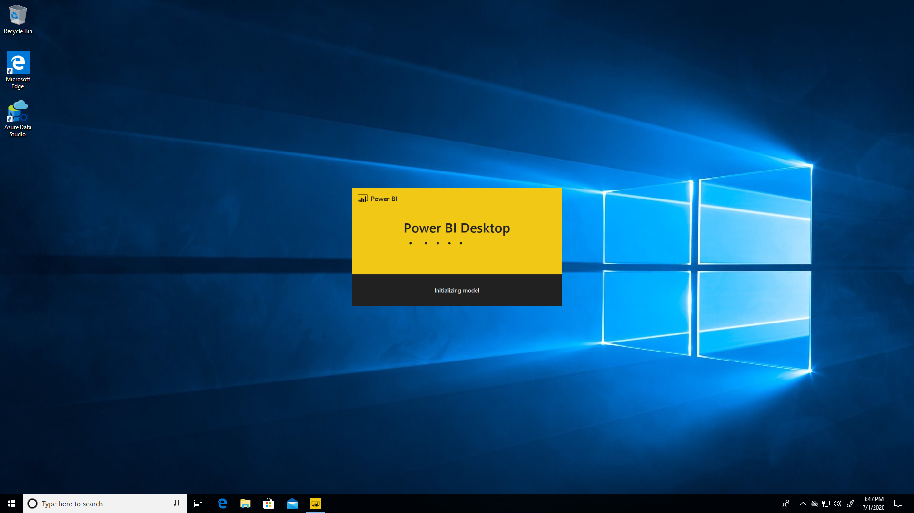
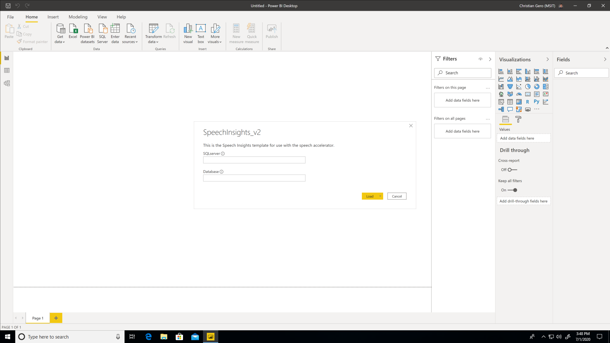
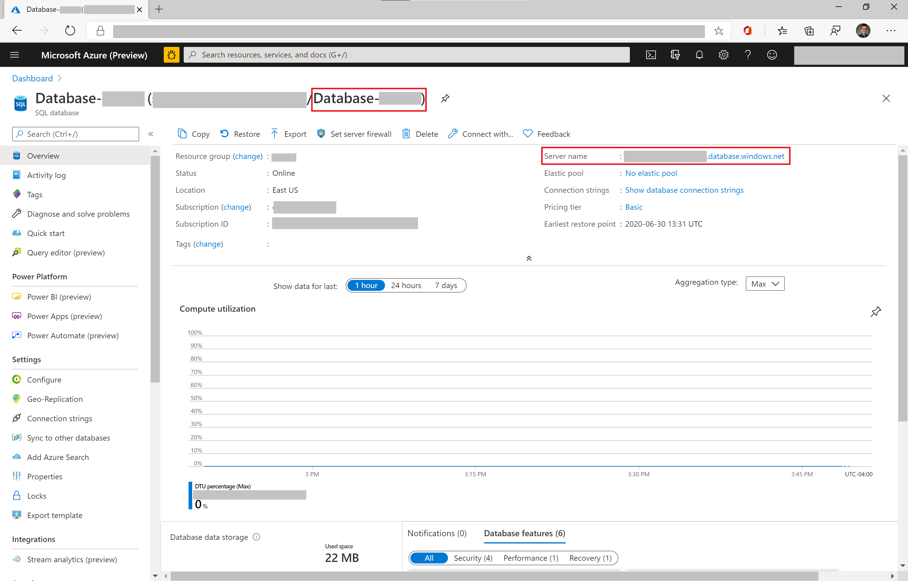
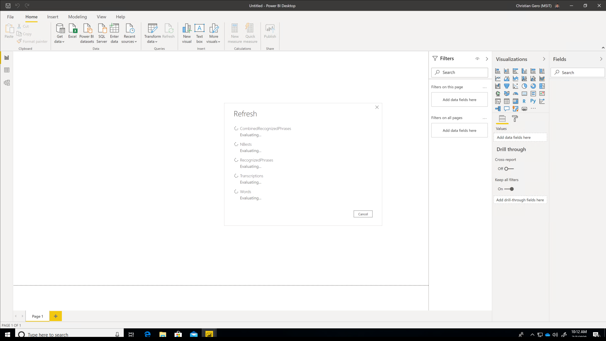
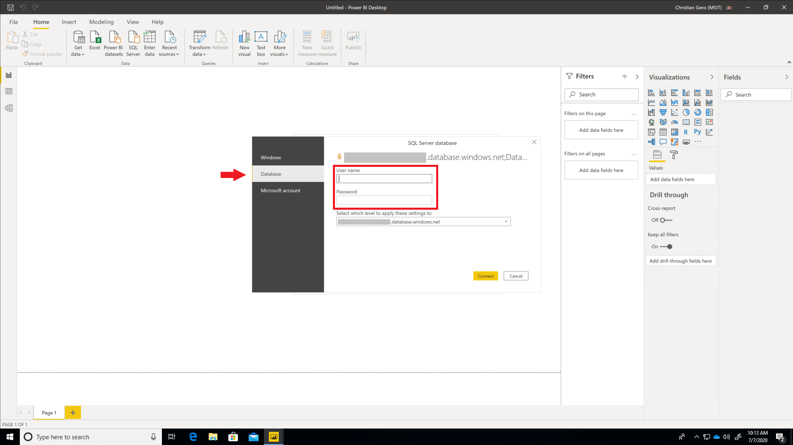
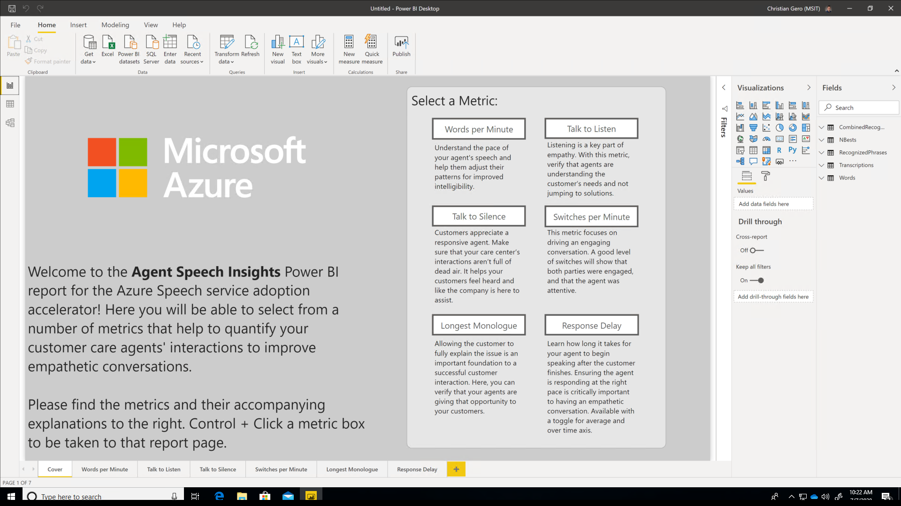

# Visualizing the transcription output in Power BI

## Setup Guide

The following guide describes how you can create Power BI reports from templates that help realize the value of the speech transcription output. For complete functionality, please ensure you have enabled Text Analytics and word-level timestamps during the [Ingestion Client](infra/guide.md) set up.

## Prerequisites

A working version of the [Ingestion Client](infra/guide.md) as well as [Power BI Desktop](aka.ms/PowerBIDownload) installed for free on your machine.

Make sure you have also [read the descriptions](PowerBI#contents) of the use cases and downloaded a copy of the report you would like to use:

 - [Speech Insights](SpeechInsights.pbit)
 - [Sentiment Insights](SentimentInsights.pbit)

## Power BI Desktop Setup Instructions

1. Ensure that you have downloaded and installed Power BI Desktop before beginning this guide. Navigate to and double click on the .pbit you downloaded. With Power BI Desktop installed properly, this should automatically load the program.

2. After Power BI Desktop has finished loading, it will prompt you to enter SQL server and database information. These are the values you declare during your ARM Template deployment, but can also be found in the Overview page of the SQL Database in your Azure Portal. Enter these values and click Load.

3. Power BI Desktop will then display a pop up that shows a Refresh of the SQL database occurring. After a few seconds, another window will appear and prompt you to enter in credentials to access your SQL database. Select Database as the credential type, and enter the user name and password you specified during the ARM template deployment of the accelerator. Then, click Connect and wait for the Refresh to complete.

4. You should now be looking at the Cover page of the Power BI report template you opened. You can navigate across pages using the tabs at the bottom, or simply control+click on the boxes on the right hand side. Feel free to customize visuals, add new pages, and change the look and feel to match your organization. Enjoy!

## Deploy to Power BI Service (optional)

Though you can get insights from your data using the free Power BI Desktop tool, sharing these visualizations with others in your organization may require licenses to Power BI Pro, Premium, and/or Embedded. More details about licensing, features, and costs can be found at www.PowerBI.com
