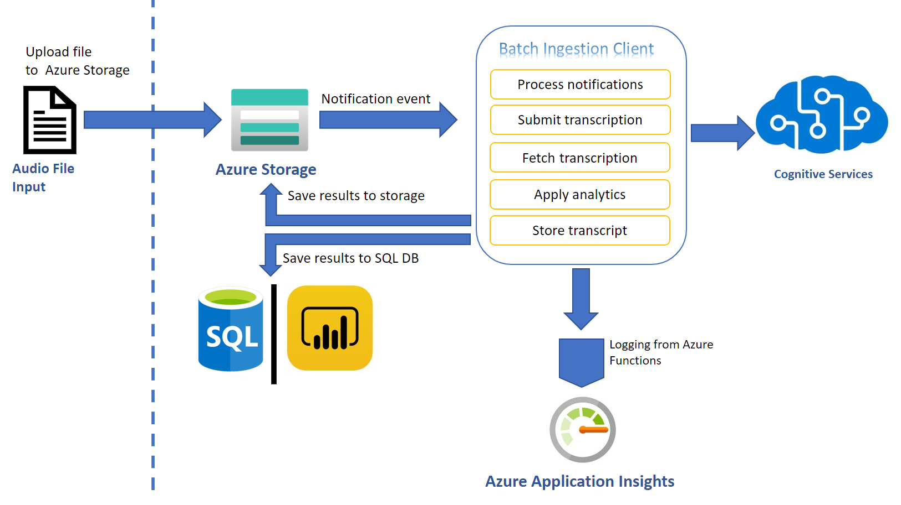
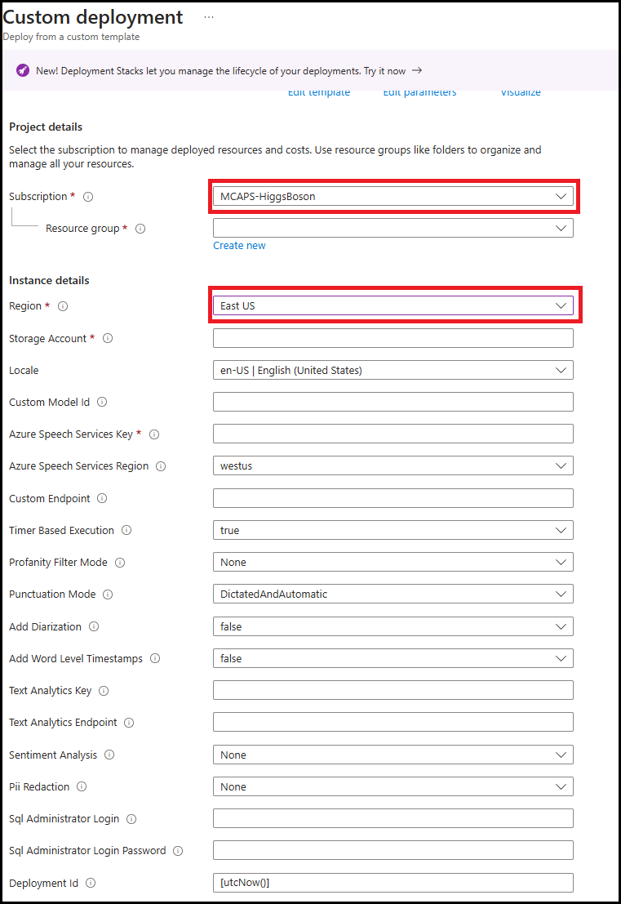
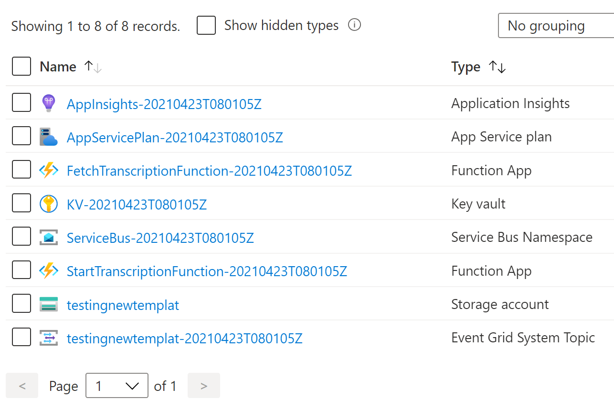
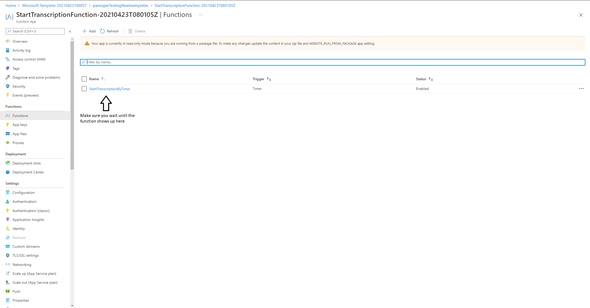
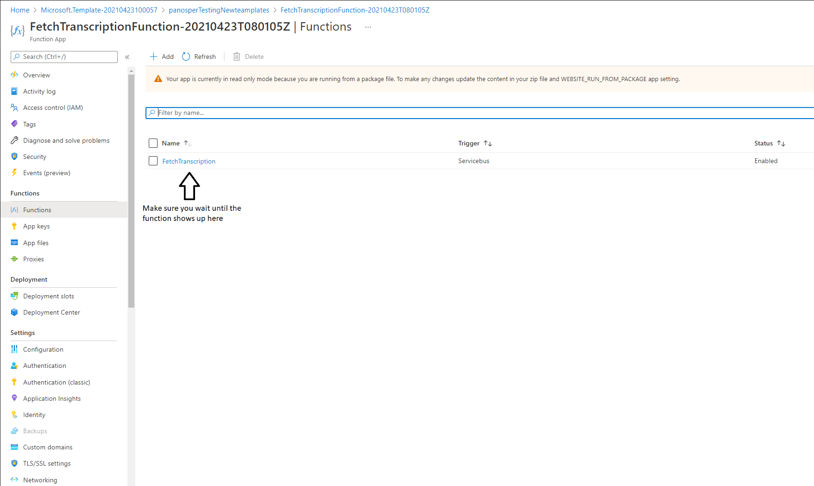
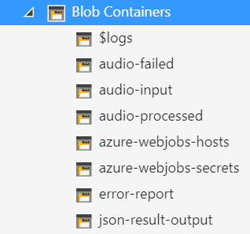

# Getting started with the Ingestion Client

The Ingestion Client can transcribe your audio files without any development effort. The Ingestion Client monitors your dedicated Azure Storage container so that new audio files are transcribed automatically as soon as they land.

Think of this tool as an automated & scalable transcription solution for all audio files in your Azure Storage. This tool is a quick and effortless way to transcribe your audio files or just explore transcription.

We created an ingestion layer (a transcription client) that will help you set up a full blown, scalable and secure transcription pipeline. Using an ARM template deployment, all the resources necessary to seamlessly process your audio files are configured and turned on.

# Architecture

The Ingestion Client is optimized to use the capabilities of the Azure Speech infrastructure. It uses Azure resources to orchestrate transcription requests to the Azure Speech service using audio files as they appear in your dedicated storage containers. You can also set up additional processing beyond transcription, such as sentiment analysis and other text analytics.

The following diagram shows the structure of this tool as defined by the ARM template.



When a file lands in a storage container, the Grid event indicates the completed upload of a file. The file is filtered and pushed to a Service bus topic. Code in Azure Functions triggered by a timer picks up the event and creates a transcription request using the Azure Speech services batch pipeline. When the transcription request is complete, an event is placed in another queue in the same service bus resource. A different Azure Function triggered by the completion event starts monitoring transcription completion status. When transcription completes, the Azure Function copies the transcript into the same container where the audio file was obtained.

The rest of the features are applied on demand. By deploying additional resources through the ARM template, you can choose to apply analytics on the transcript, produce reports or redact.

This solution can transcribe audio files automatically and at scale.

Since source code is provided in this repo, you can customize the Ingestion Client.

This tool follows these best practices:

* Optimizes the number of audio files included in each transcription to achieve the shortest possible SAS TTL.
* Retry logic optimization handles smooth scaling and transient HTTP 429 errors.
* Runs Azure Functions economically, ensuring minimal execution costs.
* Distribute load across available regions using a round robin algorithm.

# Setup Guide

Follow these steps to set up and run the tool using ARM templates.

## Prerequisites

An [Azure Account](https://azure.microsoft.com/free/) and an [Azure Speech services key](https://ms.portal.azure.com/#create/Microsoft.CognitiveServicesSpeechServices) is needed to run the Ingestion Client.

> **_NOTE:_** You need to create a Speech Resource with a paid (S0) key. The free key account will not work. Optionally for analytics you can create a Text Analytics resource too.

If the above link does not work try the following steps:

1. Go to [Azure portal](https://portal.azure.com)
2. Click on **Create a Resource**.
3. Type **Speech** and select **Speech**.
4. On the Speech resource, click **Create**.
5. You will find the subscription key under **Keys**
6. You will also need the region, so make a note of that too.
7. You need to choose the operating mode (described in the next section).

To test, we recommend you use [Microsoft Azure Storage Explorer](https://azure.microsoft.com/features/storage-explorer/).

## Ingestion Client Setup Instructions

To deploy the required infrastructure, click the button below:

[](https://portal.azure.com/#create/Microsoft.Template/uri/https%3A%2F%2Fraw.githubusercontent.com%2FAzure-Samples%2Fcognitive-services-speech-sdk%2Fmaster%2Fsamples%2Fingestion%2Fingestion-client%2Finfra%2Fmain.json)

This will result in the screen below on your browser. You will need to fill in the form provided. It is
important that all the information is correct. Let us look at the form and go through each field.



> **_NOTE:_** Use short descriptive names in the form for your resource group. Long resource group names can result in deployment error.

* Pick the Azure Subscription Id where you will create the resources.

* Either pick or create a resource group. (It would be better to have all the Ingestion Client
resources within the same resource group so we suggest you create a new resource group.)

* Pick a region. This can be the same region as your Azure Speech key.

The following settings all relate to the resources and their attributes:

* Give your storage account a name. You will be using a new storage
account rather than an existing one.

The following 2 steps are optional. If you omit them, the tool will use the base model to obtain
transcripts. If you have created a Speech model, then enter a custom model.

Transcripts are obtained by polling the service. We acknowledge that there is a cost related to that.
So, the following setting gives you the option to limit that cost by telling your Azure Function how
often you want it to fire.

* Enter the polling frequency. There are many scenarios where this would be required to be
done couple of times a day.

* Enter locale of the audio. You need to tell us what language model we need to use to
transcribe your audio.

* Enter your Azure Speech subscription key and Locale information.

The rest of the settings relate to the transcription request. You can read more about those in [How to use batch transcription](https://docs.microsoft.com/azure/cognitive-services/speech-service/batch-transcription).


* Select a profanity option.

* Select a punctuation option.

* Select to Add Diarization [all locales] [Batch Template Only].

* Select to Add Word level Timestamps [all locales] [Batch Template Only].


If you want to perform Text Analytics, add those credentials.


* Add Text analytics key

* Add Text analytics region

* Add Sentiment [Batch Template Only]

* Add Personally Identifiable Information (PII) Redaction [Batch Template Only]

> **_NOTE:_** The ARM template also allows you to customize the PII categories through the PiiCategories variable (e.g., to only redact person names and organizations set the value to "Person,Organization"). A full list of all supported categories can be found in the [PII Entity Categories](https://docs.microsoft.com/azure/cognitive-services/text-analytics/named-entity-types?tabs=personal).

If you want to further analytics we could map the transcript json we produce to a DB schema. [Batch Template Only]

* Enter SQL DB credential login

* Enter SQL DB credential password


You can feed that data to your custom PowerBI script or take the scripts included in this repository. Follow the [PowerBI guide](../PowerBI/guide.md) to set it up.

Press **Create** to create the resources. It typically takes 1-2 mins. The resources
are listed below.



If a Consumption Plan (Y1) was selected for the Azure Functions, make sure that the functions are synced with the other resources (see [Trigger syncing](https://docs.microsoft.com/azure/azure-functions/functions-deployment-technologies#trigger-syncing) for further details).

To do so, click on your **StartTranscription** function in the portal and wait until your function shows up:



Do the same for the **FetchTranscription** function:



> **_Important:_** Until you restart both Azure functions you may see errors.

## Running the Ingestion Client

Upload audio files to the newly created audio-input container (results are added to json-result-output and test-results-output containers).
Once they are done you can test your account.

Use [Microsoft Azure Storage Explorer](https://azure.microsoft.com/features/storage-explorer/) to test uploading files to your new account. The process of transcription is asynchronous. Transcription usually takes half the time of the audio track to complete.

The structure of your newly created storage account will look like the picture below.



There are several containers to distinguish between the various outputs. We suggest (for the sake of keeping things tidy) to follow the pattern and use the audio-input container as the only container for uploading your audio.

## Customizing the Ingestion Client

By default, the ARM template uses the newest version of the Ingestion Client which can be found in this repository. To use a custom version, edit the paths to the binaries inside the deployment template to point to a custom published version. You can find our published binaries [here](https://github.com/Azure-Samples/cognitive-services-speech-sdk/releases?q=ingestion+client&expanded=true).

When using Windows for development, for any changes to the resources, you need to update the `main.bicep` and generate the corresponding `main.json`. If `main.json` is not in sync with the `main.bicep`, your build will fail.

To generate `main.json`, you need to make sure Azure CLI & Bicep CLI are installed. Execute below commands to install:
To install Azure CLI:
``` bash
curl -sL https://aka.ms/InstallAzureCLIDeb | sudo bash
```
To install Bicep CLI:
```bash
az bicep install
```
Once Bicep CLI is installed execute the below command to generate `main.json`.
``` bash
az bicep build --file ./samples/ingestion/ingestion-client/infra/main.bicep
```

When using Linux, any changes to `main.bicep`, every commit will generate the corresponding `main.json`.

To publish a new version, you can use Visual Studio, right-click on the project, click **Publish** and follow the instructions.

## The Project

Although you do not need to download or change the code, you can still download it from GitHub:

```
git clone https://github.com/Azure-Samples/cognitive-services-speech-sdk
cd cognitive-services-speech-sdk/samples/ingestion/ingestion-client
```

## Costs

The created resources their pricing and corresponding plans (where applicable) are:

* [Storage Pricing](https://azure.microsoft.com/pricing/details/storage/), Simple Storage
* [Service Bus Pricing](https://azure.microsoft.com/pricing/details/service-bus/), Standard
* [Azure Functions Pricing](https://azure.microsoft.com/pricing/details/functions/), Premium / Consumption
* [Key Vault Pricing](https://azure.microsoft.com/pricing/details/key-vault/)

Optionally:

* [Sql DB Pricing](https://azure.microsoft.com/pricing/details/sql-database/single/)
* [PowerBI](https://powerbi.microsoft.com/)

The following example is indicative of the cost distributions to inform and set the cost expectations.

Assume a scenario where we are trying to transcribe 1000 mp3 files of an average length of 10mins and size of 10MB. Each of them individually landing on the storage container over the course of a business day.

* [Speech Transcription](https://azure.microsoft.com/services/cognitive-services/speech-to-text/) Costs are: 10k mins = **$166.60**
* [Service Bus](https://azure.microsoft.com/services/service-bus) Costs are: 1k events landing in 'CreateTranscriptionQueue' and another 1k in 'FetchTranscriptionQueue' = **$0.324/daily** (standing charge) for up to 13m messages/month
* [Storage](https://azure.microsoft.com/services/storage/) Costs are: Write operations are $0.0175 (per 10,000), and Read operations $0.0014 (again per 10k read operations) = ($0.0175 + $0.0014)/10 (for 1000 files) = **$0.00189**
* [Azure Functions](https://azure.microsoft.com/services/functions/) For Consumption, the costs are: The first 400,000 GB/s of execution and 1,000,000 executions are free = $0.00. For Premium functions, the base cost is: 2 instances in EP1 x 1 hour: $0.43
* [Key Vault](https://azure.microsoft.com/services/key-vault/) Costs are: 0.03/10,000 transactions (For the above scenario 1 transactions would be required per file) = **$0.003**

The total for the above scenario would be **$166.60**, with the majority of the cost being on transcription. If Premium functions are hosted, there is an additional cost of **$310.54** per month.

We hope the above scenario gives you an idea of the cost distribution. Of course will vary depending on scenario and usage pattern. Also use our [Azure Calculator](https://azure.microsoft.com/pricing/calculator/) to better understand pricing.
