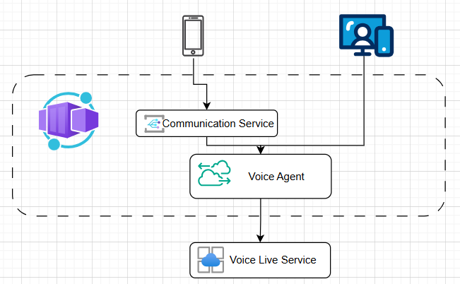
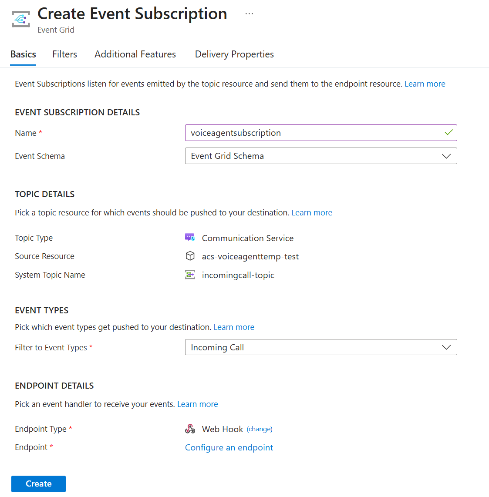

# Voice Live Agent Template with Web and ACS Clients

Lightweight template to test real-time voice calls using **Azure Communication Services (ACS)** Call Automation + **Azure Voice Live API** — no PSTN number needed. Start locally with `uv run`, deploy later to Azure Web App.

This sample demonstrates how to build a real-time voice assistant using the [Azure Speech Voice Live API](https://learn.microsoft.com/azure/ai-services/speech-service/voice-live), now in public preview.

The solution includes:
- A backend service that connects to the **Voice Live API** for real-time ASR, LLM and TTS
- Two client options: **Web browser** (microphone/speaker) and **Azure Communication Services (ACS)** phone calls
- Flexible configuration to customize prompts, ASR, TTS, and behavior
- Easy extension to other client types such as [Audiohook](https://learn.microsoft.com/azure/ai-services/speech-service/how-to-use-audiohook)

> You can also try the Voice Live API via [Azure AI Foundry](https://ai.azure.com/foundry) for quick experimentation before deploying this template to your own Azure subscription.

## Architecture



## Get Started

### Prerequisites
- [Azure CLI](https://learn.microsoft.com/en-us/cli/azure/what-is-azure-cli): `az`
- [Azure Developer CLI](https://learn.microsoft.com/en-us/azure/developer/azure-developer-cli/overview): `azd`
- [Python](https://www.python.org/about/gettingstarted/): `python`
- [UV](https://docs.astral.sh/uv/getting-started/installation/): `uv`
- Optionally [Docker](https://www.docker.com/get-started/): `docker`

### Deployment and setup
1. Sign up for a [free Azure account](https://azure.microsoft.com/free/) and create an Azure Subscription.

2. Login to Azure:

    ```shell
    azd auth login
    ```

3. Provision and deploy all the resources:

    ```shell
    azd up
    ```
    It will prompt you to provide an `azd` environment name (like "flask-app"), select a subscription from your Azure account, and select a location (like "eastus"). Then it will provision the resources in your account and deploy the latest code. If you get an error with deployment, changing the location can help, as there may be availability constraints for some of the resources.

4. When `azd` has finished deploying, you'll see an endpoint URI in the command output. Visit that URI, and you should see the API output! 🎉

5. When you've made any changes to the app code, you can just run:

    ```shell
    azd deploy
    ```

>[!NOTE]
>AZD will also setup the local Python environment for you, using `venv` and installing the required packages.


>[!NOTE]
- Region: swedencentral is strongly recommended due to AI Foundry availability.

- Post-Deployment: You can also setup ACS Event Grid subscription and PSTN to use the ACS client.

## Test the Agent

Once deployment is complete, you can test the agent through either the web client or ACS phone call.

🌐 Web Client
Go to the Azure Portal and navigate to the resource group created by the deployment.

Find the **Container App** resource.

Click into the container app, and in the Overview page, locate the Application URL.

Click the URL — a demo webpage should open.

On the webpage, click Start to begin speaking with the agent via your browser's microphone and speaker.

📞 ACS Client (Optional)
Find the **Communication Services** resource in the same resource group.

In the left-hand menu, click **Events**.

Click **+ Event Subscription**:
   - Set the **Event Type** to `IncomingCall`.
   - Set the **Endpoint Type** to `Web Hook`.
   - For **Endpoint Address**, use:  
     ```
     https://<your-container-app-url>/acs/incomingcall
     ```
     Replace `<your-container-app-url>` with the Application URLfrom your **Container App** resource's overview page.
Refer to the screenshot below for guidance:

   

Get a phone number for your ACS resource:  
   👉 [How to get a phone number (Microsoft Docs)](https://learn.microsoft.com/en-us/azure/communication-services/quickstarts/telephony/get-phone-number?tabs=windows&pivots=platform-azp-new)

Once everything is configured, call the number — your call will connect to the real-time agent.

## Clean up resources

When you no longer need the resources created in this article, run the following command to power down the app:

```bash
azd down
```

If you want to redeploy to a different region, delete the `.azure` directory before running `azd up` again. In a more advanced scenario, you could selectively edit files within the `.azure` directory to change the region.

## Local execution

Once the environment has been deployed with `azd up` you can also run the application locally.

Please follow the instructions in [the instructions in `service`](./service/README.md)

## Contributing

This project welcomes contributions and suggestions. Please see [CONTRIBUTING.md](CONTRIBUTING.md) for details.

## License

This project is licensed under the MIT License. See [LICENSE.md](LICENSE.md) for details.