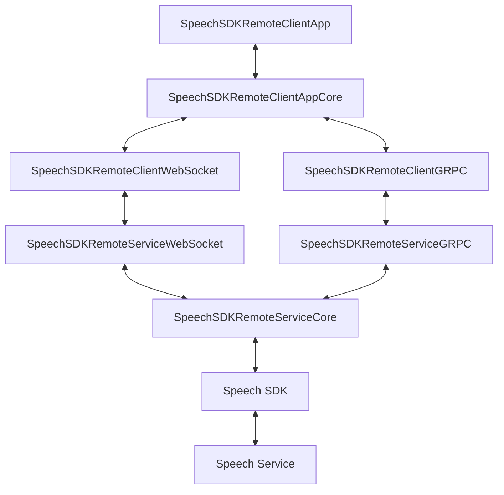

# Multi-tier Speech SDK Sample

This sample demonstrates how to implement Azure Speech SDK functionality in a multi-tier environment, enabling scenarios where audio and speech recognition results are needed on a middle-tier server rather than directly on a client device. This architecture is particularly useful for:

- Environments where the Speech SDK cannot run directly on the client device
- Scenarios requiring additional processing or business logic on a middle tier
- Applications needing to maintain persistent Speech SDK connections while handling multiple client sessions
- Systems requiring robust audio transport across unreliable networks

## Architecture Overview

The sample implements a complete multi-tier system where audio data is captured on an end-user device, transmitted to a middle-tier service using either gRPC or WebSocket transport, and then processed using the Azure Speech SDK.

## Components

### Client-Side Components
- [**SpeechSDKRemoteClientApp**](SpeechSDKRemoteClientApp/README.md): Example application demonstrating client-side audio capture and streaming
- [**SpeechSDKRemoteClientAppCore**](SpeechSDKRemoteClientAppCore/README.md): Core client functionality and shared interfaces
- [**SpeechSDKRemoteClientGRPC**](SpeechSDKRemoteClientGRPC/README.md): gRPC-based transport implementation
- [**SpeechSDKRemoteClientWebSocket**](SpeechSDKRemoteClientWebSocket/README.md): WebSocket-based transport implementation

### Server-Side Components
- [**SpeechSDKRemoteServiceCore**](SpeechSDKRemoteServiceCore/README.md): Core service functionality and Speech SDK integration
- [**SpeechSDKRemoteServiceGRPC**](SpeechSDKRemoteServiceGRPC/README.md): gRPC service implementation
- [**SpeechSDKRemoteServiceWebSocket**](SpeechSDKRemoteServiceWebSocket/README.md): WebSocket service implementation

### Shared Components
- [**Messages**](Messages/README.md): Common message types and audio format definitions
- [**SpeechSDKRemoteSharedGRPC**](SpeechSDKRemoteSharedGRPC/README.md): Shared gRPC protocol definitions
- [**SpeechSDKRemoteSharedWebSocket**](SpeechSDKRemoteSharedWebSocket/README.md): Shared WebSocket message definitions

## Transport Options

The sample provides two transport implementations, each with its own advantages:

### gRPC Transport
- Protocol Buffer-based binary serialization for efficient data transfer
- HTTP/2 features including multiplexing and header compression
- Strongly typed contracts and built-in code generation
- Better for structured data and bidirectional streaming
- Ideal for internal network communication

### WebSocket Transport
- Simpler protocol with lower overhead
- Better browser support and easier web integration
- Works well through most proxies and firewalls
- Suitable for both internal and external network communication
- More flexible message format options

## Getting Started

1. Choose your transport implementation (gRPC or WebSocket)
2. Configure the middle-tier service with your Azure Speech Service credentials
3. Deploy the service components to your middle-tier environment
4. Configure the client application with your service endpoint
5. Run the client application to begin streaming audio

For detailed implementation instructions, refer to the README files in each component's directory:
- [gRPC Client Implementation](./SpeechSDKRemoteClientGRPC/README.md)
- [WebSocket Client Implementation](./SpeechSDKRemoteClientWebSocket/README.md)

## License

This project is licensed under the MIT License. See `LICENSE.md` for details.
