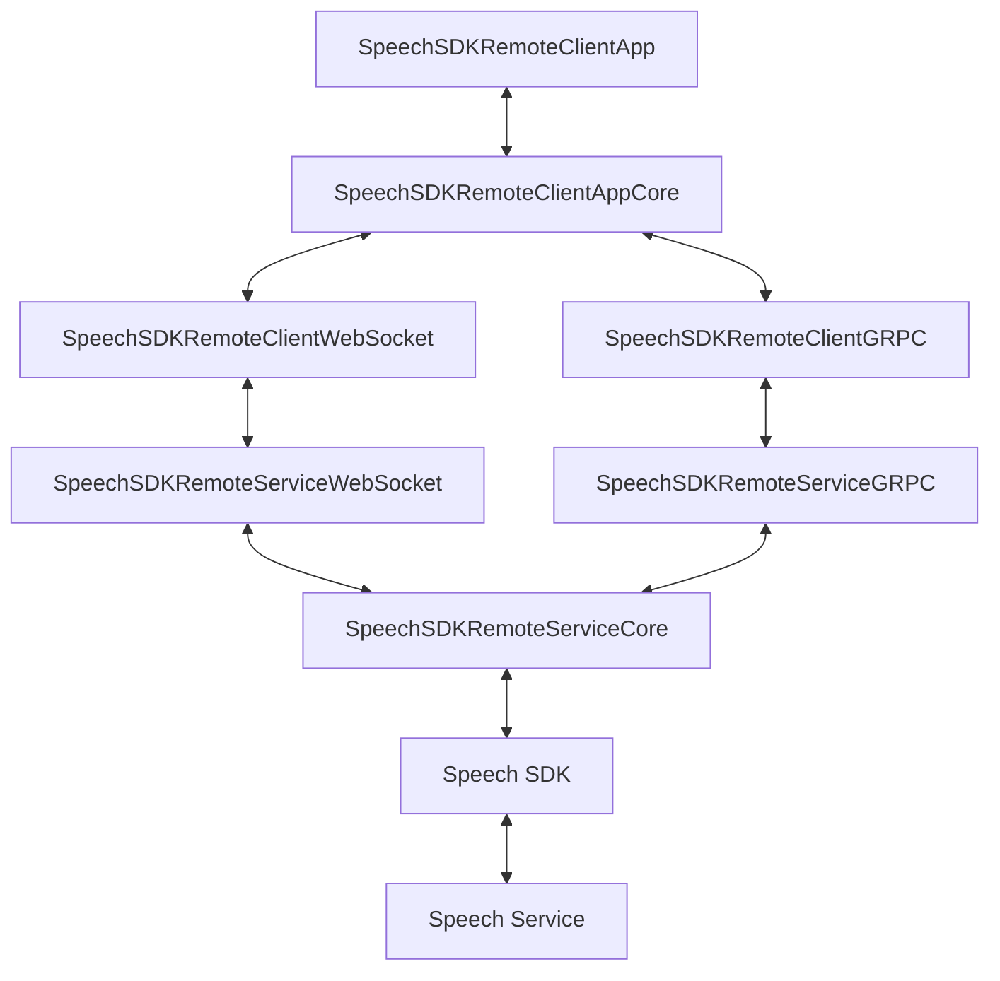

# Multi-tier Speech SDK Sample

This sample covers teh components needed to use the Azure Speech SDK in a multi-tier environment. In this sample, audio data is received by an end user device and sent to a middle tier using robust transport where it is give to the Azure Speech SDK for recognition. 

